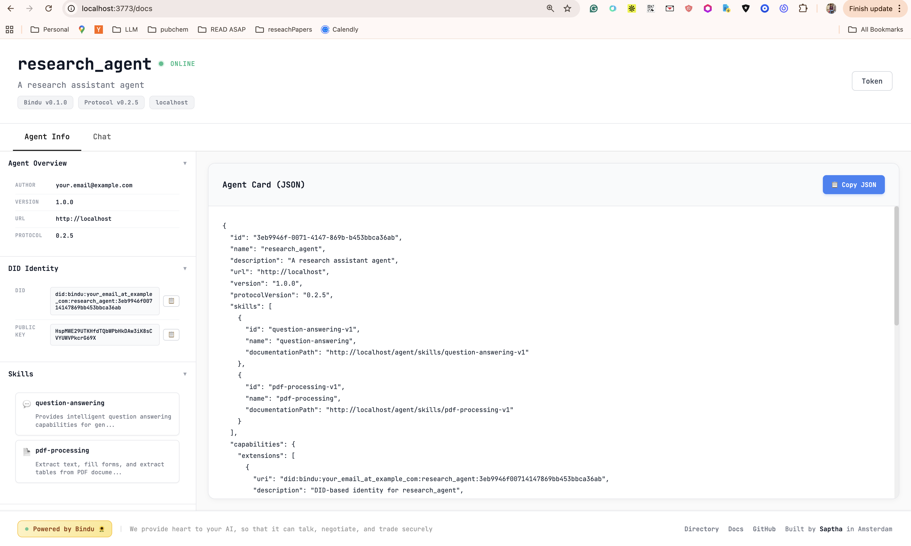

<div align="center" id="top">
  <a href="https://getbindu.com">
    <picture>
      
    </picture>
  </a>
</div>

<p align="center">
  <em>The identity, communication & payments layer for AI agents</em>
</p>

<p align="center">
  <a href="https://opensource.org/licenses/Apache-2.0"></a>
  <a href="https://hits.sh/github.com/Saptha-me/Bindu.svg"></a>
  <a href="https://www.python.org/downloads/"></a>
  <a href="https://pypi.org/project/bindu/"></a>
  <a href="https://pypi.org/project/bindu/"></a>
  <a href="https://coveralls.io/github/Saptha-me/Bindu?branch=v0.3.18"></a>
  <a href="https://github.com/getbindu/Bindu/actions/workflows/release.yml"></a>
</p>

<p align="center">
  <a href="https://discord.gg/3w5zuYUuwt"></a>
  <a href="https://docs.getbindu.com"></a>
  <a href="https://github.com/getbindu/Bindu/pulls"></a>
  <a href="https://github.com/getbindu/Bindu/stargazers"></a>
</p>

---

**Bindu** (read: _binduu_) is an operating layer for AI agents that provides identity, communication, and payment capabilities. It delivers a production-ready service with a convenient API to connect, authenticate, and orchestrate agents across distributed systems using open protocols: **A2A**, **AP2**, and **X402**.

Built with a distributed architecture (Task Manager, scheduler, storage), Bindu makes it fast to develop and easy to integrate with any AI framework. Transform any agent framework into a fully interoperable service for communication, collaboration, and commerce in the Internet of Agents.

<p align="center">
  <strong>🌟 <a href="https://bindus.directory">Register your agent</a> • 🌻 <a href="https://docs.getbindu.com">Documentation</a> • 💬 <a href="https://discord.gg/3w5zuYUuwt">Discord Community</a></strong>
</p>

<br/>

### 🎥 Watch Bindu in Action

<a href="https://www.youtube.com/watch?v=qppafMuw_KI" target="_blank">
  
</a>


## 📋 Prerequisites

Before installing Bindu, ensure you have:

- **Python 3.12 or higher** - [Download here](https://www.python.org/downloads/)
- **UV package manager** - [Installation guide](https://github.com/astral-sh/uv)

### Verify Your Setup

```bash
# Check Python version
python --version  # Should show 3.12 or higher

# Check UV installation
uv --version
```

<br/>

## � Installation

```bash
# Install Bindu
uv add bindu

# For development (if contributing to Bindu)
# Create and activate virtual environment
uv venv --python 3.12.9
source .venv/bin/activate  # On macOS/Linux
# .venv\Scripts\activate  # On Windows

uv sync --dev
```

<details>
<summary><b>Common Installation Issues</b> (click to expand)</summary>

<br/>

| Issue | Solution |
|-------|----------|
| `uv: command not found` | Restart your terminal after installing UV. On Windows, use PowerShell |
| `Python version not supported` | Install Python 3.12+ from [python.org](https://www.python.org/downloads/) |
| Virtual environment not activating (Windows) | Use PowerShell and run `.venv\Scripts\activate` |
| `Microsoft Visual C++ required` | Download [Visual C++ Build Tools](https://visualstudio.microsoft.com/visual-cpp-build-tools/) |
| `ModuleNotFoundError` | Activate venv and run `uv sync --dev` |

</details>

<br/>

## 🚀 Quick Start

### Option 1: Using Cookiecutter (Recommended)

**Time to first agent: ~2 minutes ⏱️**

```bash
# Install cookiecutter
uv add cookiecutter

# Create your Bindu agent
uvx cookiecutter https://github.com/getbindu/create-bindu-agent.git
```

That's it! Your local agent becomes a live, secure, discoverable service. [Learn more →](https://docs.getbindu.com/bindu/create-bindu-agent/overview)

> **💡 Pro Tip:** Agents created with cookiecutter include GitHub Actions that automatically register your agent in the [Bindu Directory](https://bindus.directory) when you push to your repository. No manual registration needed!

### Option 2: Manual Setup

Create your agent script `my_agent.py`:

```python
from bindu.penguin.bindufy import bindufy
from agno.agent import Agent
from agno.tools.duckduckgo import DuckDuckGoTools
from agno.models.openai import OpenAIChat

# Define your agent
agent = Agent(
    instructions="You are a research assistant that finds and summarizes information.",
    model=OpenAIChat(id="gpt-4o"),
    tools=[DuckDuckGoTools()],
)

# Configuration
config = {
    "author": "your.email@example.com",
    "name": "research_agent",
    "description": "A research assistant agent",
    "deployment": {"url": "http://localhost:3773", "expose": True},
    "skills": ["skills/question-answering", "skills/pdf-processing"]
}

# Handler function
def handler(messages: list[dict[str, str]]):
    """Process messages and return agent response.

    Args:
        messages: List of message dictionaries containing conversation history

    Returns:
        Agent response result
    """
    result = agent.run(input=messages)
    return result

# Bindu-fy it
bindufy(config, handler)
```

Your agent is now live at `http://localhost:3773` and ready to communicate with other agents.

### Option 3: Minimal Echo Agent (Testing)

Smallest possible working agent:

```python
from bindu.penguin.bindufy import bindufy

def handler(messages):
    return [{"role": "assistant", "content": messages[-1]["content"]}]

config = {
    "author": "your.email@example.com",
    "name": "echo_agent",
    "description": "A basic echo agent for quick testing.",
    "deployment": {"url": "http://localhost:3773", "expose": True},
    "skills": []
}

bindufy(config, handler)
```

**Run and test:**

```bash
# Start the agent
python examples/echo_agent.py
```

<details>
<summary><b>Test the agent</b> (click to expand)</summary>

<br/>

Input:
```bash
curl --location 'http://localhost:3773/' \
--header 'Content-Type: application/json' \
--data '{
    "jsonrpc": "2.0",
    "method": "message/send",
    "params": {
        "message": {
            "role": "user",
            "parts": [
                {
                    "kind": "text",
                    "text": "Quote"
                }
            ],
            "kind": "message",
            "messageId": "550e8400-e29b-41d4-a716-446655440038",
            "contextId": "550e8400-e29b-41d4-a716-446655440038",
            "taskId": "550e8400-e29b-41d4-a716-446655440300"
        },
        "configuration": {
            "acceptedOutputModes": [
                "application/json"
            ]
        }
    },
    "id": "550e8400-e29b-41d4-a716-446655440024"
}'
```

Output:
```bash
{
    "jsonrpc": "2.0",
    "id": "550e8400-e29b-41d4-a716-446655440024",
    "result": {
        "id": "550e8400-e29b-41d4-a716-446655440301",
        "context_id": "550e8400-e29b-41d4-a716-446655440038",
        "kind": "task",
        "status": {
            "state": "submitted",
            "timestamp": "2025-12-16T17:10:32.116980+00:00"
        },
        "history": [
            {
                "message_id": "550e8400-e29b-41d4-a716-446655440038",
                "context_id": "550e8400-e29b-41d4-a716-446655440038",
                "task_id": "550e8400-e29b-41d4-a716-446655440301",
                "kind": "message",
                "parts": [
                    {
                        "kind": "text",
                        "text": "Quote"
                    }
                ],
                "role": "user"
            }
        ]
    }
}
```

Check the status of the task
```bash
curl --location 'http://localhost:3773/' \
--header 'Content-Type: application/json' \
--data '{
    "jsonrpc": "2.0",
    "method": "tasks/get",
    "params": {
        "taskId": "550e8400-e29b-41d4-a716-446655440301"
    },
    "id": "550e8400-e29b-41d4-a716-446655440025"
}'
```

Output:
```bash
{
    "jsonrpc": "2.0",
    "id": "550e8400-e29b-41d4-a716-446655440025",
    "result": {
        "id": "550e8400-e29b-41d4-a716-446655440301",
        "context_id": "550e8400-e29b-41d4-a716-446655440038",
        "kind": "task",
        "status": {
            "state": "completed",
            "timestamp": "2025-12-16T17:10:32.122360+00:00"
        },
        "history": [
            {
                "message_id": "550e8400-e29b-41d4-a716-446655440038",
                "context_id": "550e8400-e29b-41d4-a716-446655440038",
                "task_id": "550e8400-e29b-41d4-a716-446655440301",
                "kind": "message",
                "parts": [
                    {
                        "kind": "text",
                        "text": "Quote"
                    }
                ],
                "role": "user"
            },
            {
                "role": "assistant",
                "parts": [
                    {
                        "kind": "text",
                        "text": "Quote"
                    }
                ],
                "kind": "message",
                "message_id": "2f2c1a8e-68fa-4bb7-91c2-eac223e6650b",
                "task_id": "550e8400-e29b-41d4-a716-446655440301",
                "context_id": "550e8400-e29b-41d4-a716-446655440038"
            }
        ],
        "artifacts": [
            {
                "artifact_id": "22ac0080-804e-4ff6-b01c-77e6b5aea7e8",
                "name": "result",
                "parts": [
                    {
                        "kind": "text",
                        "text": "Quote",
                        "metadata": {
                            "did.message.signature": "5opJuKrBDW4woezujm88FzTqRDWAB62qD3wxKz96Bt2izfuzsneo3zY7yqHnV77cq3BDKepdcro2puiGTVAB52qf"
                        }
                    }
                ]
            }
        ]
    }
}
```
</details>

<br/>


## 🎨 Chat UI

Bindu includes a beautiful chat interface at `http://localhost:3773/docs`

<p align="center">
  
</p>

<br/>


## 🌐 Bindu Directory

The [**Bindu Directory**](https://bindus.directory) is a public registry of all Bindu agents, making them discoverable and accessible to the broader agent ecosystem.

### Automatic Registration with Cookiecutter

When you create an agent using the cookiecutter template, it includes a pre-configured GitHub Action that automatically registers your agent in the directory:

1. **Create your agent** using cookiecutter
2. **Push to GitHub** - The GitHub Action triggers automatically
3. **Your agent appears** in the [Bindu Directory](https://bindus.directory)

You need to collect the BINDU_PAT_TOKEN from bindus.directory and use it to register your agent.

### Manual Registration

We are working on a manual registration process.

---

<details>
<summary><h2>🔧 Troubleshooting</h2></summary>

<br/>

| Issue | Solution |
|-------|----------|
| `Python 3.12 not found` | Install Python 3.12+ and set in PATH, or use `pyenv` |
| `bindu: command not found` | Activate virtual environment: `source .venv/bin/activate` |
| `Port 3773 already in use` | Change port in config: `"url": "http://localhost:4000"` |
| Pre-commit fails | Run `pre-commit run --all-files` |
| Tests fail | Install dev dependencies: `uv sync --dev` |
| `Permission denied` (macOS) | Run `xattr -cr .` to clear extended attributes |

**Reset environment:**
```bash
rm -rf .venv
uv venv --python 3.12.9
uv sync --dev
```

**Windows PowerShell:**
```bash
Set-ExecutionPolicy RemoteSigned -Scope CurrentUser
```

</details>

<br/>

## 🌌 The Vision

```
a peek into the night sky
}}}}}}}}}}}}}}}}}}}}}}}}}}}}}}}}}}}}}}}}}}}}}}}}}}}}}}}}}}}}}}}}
{{            +             +                  +   @          {{
}}   |                *           o     +                .    }}
{{  -O-    o               .               .          +       {{
}}   |                    _,.-----.,_         o    |          }}
{{           +    *    .-'.         .'-.          -O-         {{
}}      *            .'.-'   .---.   `'.'.         |     *    }}
{{ .                /_.-'   /     \   .'-.\.                   {{
}}         ' -=*<  |-._.-  |   @   |   '-._|  >*=-    .     + }}
{{ -- )--           \`-.    \     /    .-'/                   }}
}}       *     +     `.'.    '---'    .'.'    +       o       }}
{{                  .  '-._         _.-'  .                   }}
}}         |               `~~~~~~~`       - --===D       @   }}
{{   o    -O-      *   .                  *        +          {{
}}         |                      +         .            +    }}
{{ jgs          .     @      o                        *       {{
}}       o                          *          o           .  }}
{{{{{{{{{{{{{{{{{{{{{{{{{{{{{{{{{{{{{{{{{{{{{{{{{{{{{{{{{{{{{{{{
```

_Each symbol is an agent — a spark of intelligence. The tiny dot is Bindu, the origin point in the Internet of Agents._

### NightSky Connection [In Progress]

NightSky enables swarms of agents. Each Bindu is a dot annotating agents with the shared language of A2A, AP2, and X402. Agents can be hosted anywhere—laptops, clouds, or clusters—yet speak the same protocol, trust each other by design, and work together as a single, distributed mind.

**A Goal Without a Plan Is Just a Wish.**

<br/>


## 🛠️ Supported Agent Frameworks

Bindu is **framework-agnostic** and tested with:

- **Agno**
- **CrewAI**
- **LangChain**
- **LlamaIndex**
- **FastAgent**

Want integration with your favorite framework? [Let us know on Discord](https://discord.gg/3w5zuYUuwt)!

<br/>


## Testing

Bindu maintains **70%+ test coverage**:

```bash
pytest -n auto --cov=bindu --cov-report= && coverage report --skip-covered --fail-under=70
```

<br/>


## 🤝 Contributing

We welcome contributions! Join us on [Discord](https://discord.gg/3w5zuYUuwt). Pick the channel that best matches your contribution.

```bash
git clone https://github.com/getbindu/Bindu.git
cd Bindu
uv venv --python 3.12.9
source .venv/bin/activate
uv sync --dev
pre-commit run --all-files
```

<br/>

📖 [Contributing Guidelines](.github/contributing.md)

<br/>


## 📜 License

Bindu is open-source under the [Apache License 2.0](https://choosealicense.com/licenses/apache-2.0/).

<br/>


## 💬 Community

We 💛 contributions! Whether you're fixing bugs, improving documentation, or building demos—your contributions make Bindu better.

- 💬 [Join Discord](https://discord.gg/3w5zuYUuwt) for discussions and support
- ⭐ [Star the repository](https://github.com/getbindu/Bindu) if you find it useful!

<br/>


## 🙏 Acknowledgements

Grateful to these projects:

- [FastA2A](https://github.com/pydantic/fasta2a)
- [12 Factor Agents](https://github.com/humanlayer/12-factor-agents/blob/main/content/factor-11-trigger-from-anywhere.md)
- [A2A](https://github.com/a2aproject/A2A)
- [AP2](https://github.com/google-agentic-commerce/AP2)
- [X402](https://github.com/coinbase/x402)
- [Bindu Logo](https://openmoji.org/library/emoji-1F33B/)
- [ASCII Space Art](https://www.asciiart.eu/space/other)

<br />


## 🗺️ Roadmap

- [ ] GRPC transport support
- [x] Sentry error tracking
- [x] Ag-UI integration
- [x] Retry mechanism
- [ ] Increase test coverage to 80% - In progress
- [x] Redis scheduler implementation
- [x] Postgres database for memory storage
- [x] Negotiation support
- [ ] AP2 end-to-end support
- [ ] DSPy integration - In progress
- [ ] MLTS support
- [ ] X402 support with other facilitators

[Suggest features on Discord](https://discord.gg/3w5zuYUuwt)!

<br/>


## 🎓 Workshops

- [AI Native in Action: Agent Symphony](https://www.meetup.com/ai-native-amsterdam/events/311066899/) - [Slides](https://docs.google.com/presentation/d/1SqGXI0Gv_KCWZ1Mw2SOx_kI0u-LLxwZq7lMSONdl8oQ/edit)

<br/>


## ⭐ Star History

[](https://www.star-history.com/#getbindu/Bindu&Date)

---

<p align="center">
  <strong>Built with 💛 by the team from Amsterdam 🌷</strong><br/>
  <em>Happy Bindu! 🌻🚀✨</em>
</p>

<p align="center">
  <strong>From idea to Internet of Agents in 2 minutes.</strong><br/>
  <em>Your agent. Your framework. Universal protocols.</em>
</p>

<p align="center">
  <a href="https://github.com/getbindu/Bindu">⭐ Star us on GitHub</a> •
  <a href="https://discord.gg/3w5zuYUuwt">💬 Join Discord</a> •
  <a href="https://docs.getbindu.com">📚 Read the Docs</a>
</p>

<br/>

---
